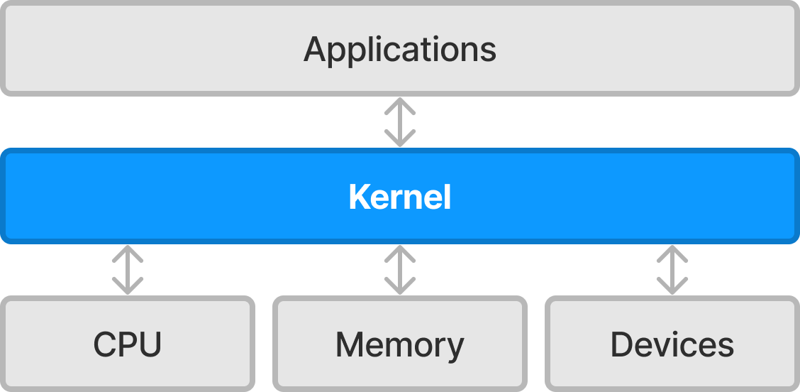
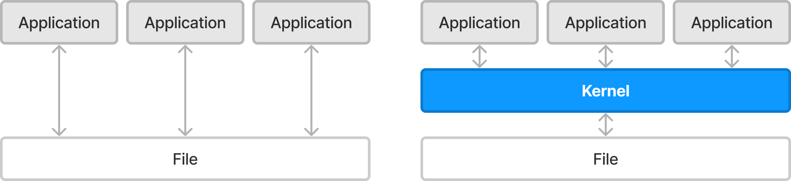
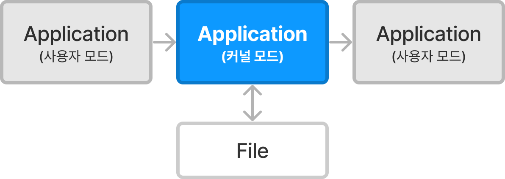

## 1. 운영체제
---
- **운영체제**(Operating System, OS)는 사용자의 하드웨어, 시스템 자원을 관리하고 프로그램에 대한 일반적 서비스를 지원하는 시스템 소프트웨어
- 사용자와 컴퓨터 간 인터페이스를 제공하여 사용자가 컴퓨터를 사용하기 편하게 함
- 응용 프로그램과 컴퓨터 하드웨어 사이의 중재 역할을 함

## 2. 커널
---
- 커널(Kernel)은 컴퓨터 운영체제의 핵심이 되는 컴퓨터 프로그램
- 커널은 시스템의 모든 것을 완전히 제어함
- OS의 다른 부분 및 응용 프로그램 수행에 필요한 여러 가지 서비스를 제공함

### 2-1. 커널의 역할
1. 보안
	- 커널은 컴퓨터 하드웨어와 프로세스의 보안을 책임짐
2. 자원 관리
	- 한정된 시스템 자원을 효율적으로 관리하여 프로그램의 실행을 원활하게 함
	- 특히 프로세스에 처리기를 할당하는 것을 스케줄링이라 함
3. 추상화
	 - 일반적으로 커널은 OS의 복잡한 내부를 감추고 깔끔하고 일관성 있는 인터페이스를 하드웨어에 제공하기 위해 몇 가지 하드웨어 추상화들을 구현함

## 3. 시스템 콜
---

위의 이미지처럼 프로그램은 커널을 통한 간접적인 연결이 되어있음

여러 프로그램이 하나의 파일에 직접적으로 접근하면 문제가 발생함
따라서 자원 보호를 위해 프로그램의 직접 접근을 방지하고 커널을 통해 접근함

### 3-1. 시스템 콜이란
- 커널은 부팅 과정에서 전체 메모리 리소스 중 일정 부분을 점유하여 동작하고 인터럽트 등 모든 하드웨어에 접근이 가능
- 응용 프로그램은 위의 이미지처럼 여러 상황에서 커널에 의존해야 함
- 응용 프로그램에서 커널의 기능을 사용하는 방법이 **시스템 호출**(System Call, 시스템 콜)

### 3-2. 사용자 모드와 커널 모드
- 사용자 모드는 커널의 기능을 사용할 수 없는 모드
- 일반적으로 응용 프로그램은 사용자 모드로 실행
- 시스템 콜을 통해 사용자 모드에서 커널 모드로 변경을 하여 커널의 기능을 사용함

